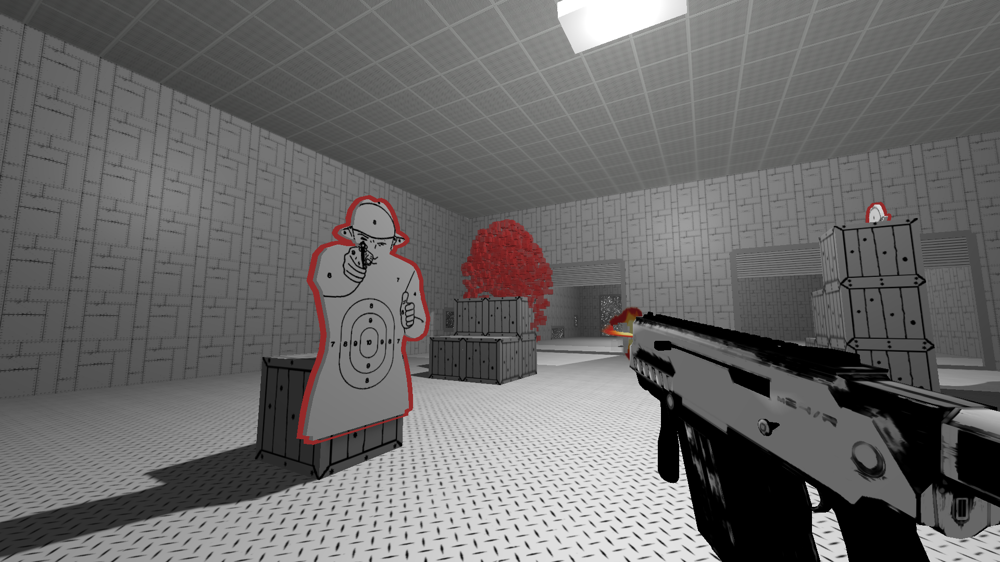
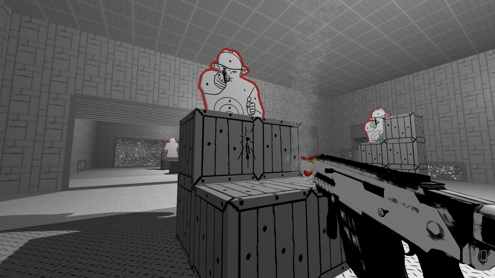
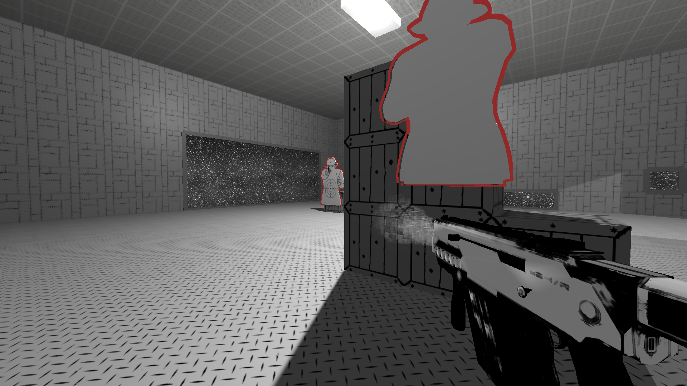
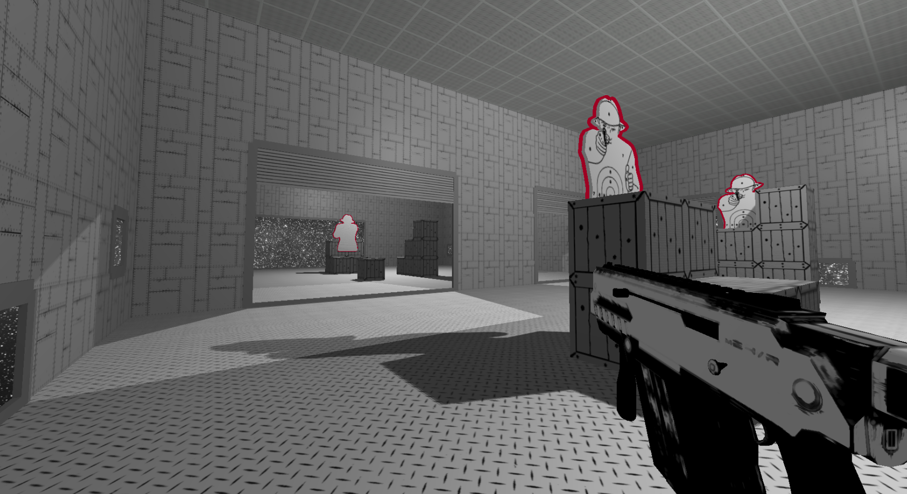
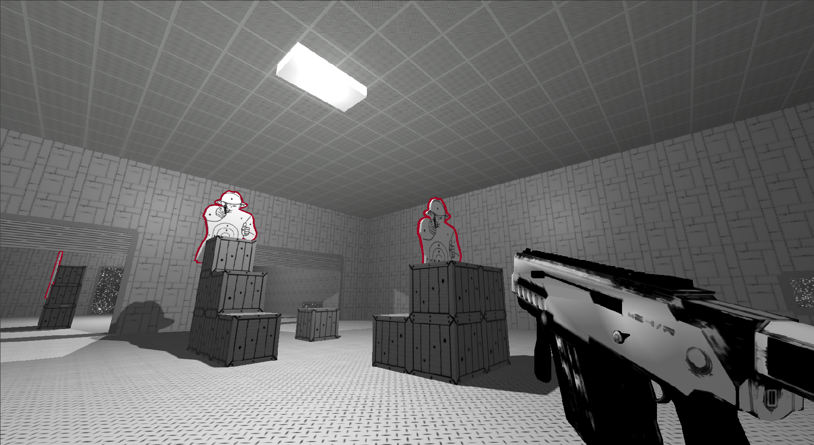

# FPS GAME ENGINE (Under Developement -- Linux)  

An OpenGL C++ game engine specifically for 3D First Person Shooter games. I am developing it alongside a game called **Mad Pit**  

## Mad Pit  

**Mad** from the 2009 EA Wii title "Mad World", where I got inspiration for a similar black and white aesthetic.

**Pit** from the 2009 Activision/Infinity Ward "Call of Duty MW2", where the player is tasked to run around a military shooting exercise in the mission "The Pit".  

Essentially, Mad Pit will combine the best of both worlds, a franctic speedrunning challenge in a singular atmosphere.  

## Developement Screenshots

## External Tools

I am using [GLM](https://glm.g-truc.net/0.9.9/index.html) to handle vector, matrices, and their mathematical operations, [Assimp](http://www.assimp.org/) as a 3D asset loader, and [stb](https://github.com/nothings/stb) as an image importer.

## Contact

Feel free to contact me on my email: hadjchaib.adrien@gmail.com